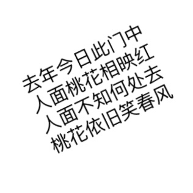
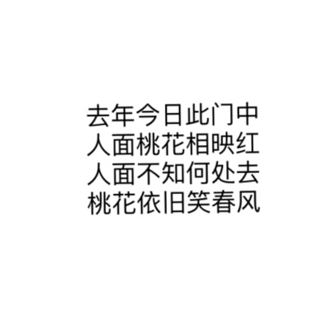

# 图像文本内容水平矫正工具

本项目提供了一个图像处理工具，用于检测图像中的文本方向，并根据需要调整图像的旋转角度，使图像中文的本内容水平显示。

| 输入         | 输出        |
| ------------------------ | ------------------------ |
|     |    |

## 依赖环境

- Python 3.x
- OpenCV
- PaddleOCR
- NumPy


安装所需的依赖项：

```bash
pip install opencv-python paddlepaddle paddleocr numpy
```

## 使用方法
```
python rotate.py input.png output.png
```

## 工作原理

1. **文本框检测**：利用 `PaddleOCR` 检测图像中的文本框，获取文本的定位信息。

2. **计算旋转角度**：通过分析文本框的几何属性，计算出将图像旋转至水平所需的角度。

3. **图像旋转**：根据计算出的角度，旋转图像使文本内容呈水平状态。

4. **文本方向检测**：使用 `PaddleOCR` 的文本方向分类器，检查旋转后的图像文本是否出现倒立。

5. **矫正倒立文本**：若图像文本倒立，则进一步旋转图像 180°，使文本恢复正常方向。

## 贡献

欢迎参与贡献，你可以：

- Fork 本仓库并提交 Pull Request。
- 在 Issues 区域报告问题或提出改进建议。

## 许可证

本项目采用 MIT 许可证，详细信息请查看 [LICENSE](LICENSE) 文件。

## 鸣谢

- **PaddleOCR**：一个开源的光学字符识别（OCR）工具，提供本项目中的文本检测功能。
- **OpenCV**：一个强大的计算机视觉库，负责处理图像操作，如旋转和调整大小。

---

欲了解更多关于 PaddleOCR 和 OpenCV 的使用信息，请参考它们的官方文档：
- [PaddleOCR](https://github.com/PaddlePaddle/PaddleOCR)
- [OpenCV](https://opencv.org/)
